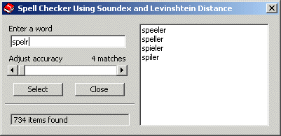



## A Comprehensive Spell Checker Revisited 4 \(Update 12 Aug 2012\)

### Description

This is an improved version of the spell checker from Shelz's COTM "A Comprehensive Spell Checker" at txtCodeId=65992. It includes a modified Russell Soundex phonetic algorithm and the Levenshtein Distance algorithm. It is now a *very* fast and effective spell checker solution... 

It impressed me with its most effective and concise spell checking algorithms, a perfect demo project, and the smart way it provided a complete database of words in a 1.3 MB download... 

But like many other spell checkers it had a common limitation... 

The basic aim of the Soundex algorithm is for names with the same pronunciation to be encoded the same so that matching can occur despite minor differences in spelling. The Soundex for a word consists of a letter followed by three numbers: the letter is the first letter of the name, and the numbers encode the remaining consonants. Therefore, only words beginning with the same first letter are compared for similar pronunciation using the standard algorithm... 

This version of the Russell Soundex algorithm has been modified to allow the matching of words that start with differing first letters so as not to assume that the first letter is always known. In this version the encoding always begins with the first letter of the word... 

The Levenshtein Distance algo marries perfectly with the results to identify the correct spelling for the given (mis-spelt) word every time! A search on the word "apolstry" with the minimum successful Levenshtein Distance returns just four words where one of these is "upholstery"... 

[Version 2] - Removed the dependence on the DAO library and is contained in a single text file. The Soundex encoding has been extended to include a 'reverse soundex' of all words (encoding from the end of the words backwards as well). On my 866MHz PC the access database took minutes to create the words database and was quite slow processing the lookup query, particularly after adding the reverse soundex to the query. Creating the database now takes 25 seconds and the lookups are now fast enough to be in real time (updated with every text entry change event)... 

[Update 18 Feb 09] - Improved speed of data loading at form load from 1.2 to 0.9 seconds on 866MHz PC. On my Athlon 4000+ the database builds in under 10 seconds and the data loads at form load in well under 0.5 seconds. On your average PC this would be fast enough to unload the form every use and re-load it when needed without the user experiencing any delay... 

[Update 21 Feb 09] - Added code to normalise words file to expected format (removes empty lines and converts comma delimited files)... 

[Version 3] - Considerably improved speed of both Soundex and Levenshtein Distance algos by eliminating Mid$(s,i,1) creating a temp string for every character and comparing chars, to using copymemory to grab the unicode value and comparing int's instead. I think the MidI code used was authored by Bruce McKinney, but if it is yours let me know and I will give you credit... 

[Version 4] - Injected some asm machine code into the database creation sub and now builds the database in a blink! Big thanks to Robert Rayment for your generous help with as$embler

Happy coding, Rd :)
 
### More Info
 

             |
---                |---
**Submitted On**   |2012-08-12 20:48:48
**By**             |[Rde](https://github.com/Planet-Source-Code/PSCIndex/blob/master/ByAuthor/rde.md)
**Level**          |Intermediate
**User Rating**    |4.9 (93 globes from 19 users)
**Compatibility**  |VB 4\.0 \(32\-bit\), VB 5\.0, VB 6\.0
**Category**       |[Miscellaneous](https://github.com/Planet-Source-Code/PSCIndex/blob/master/ByCategory/miscellaneous__1-1.md)
**World**          |[Visual Basic](https://github.com/Planet-Source-Code/PSCIndex/blob/master/ByWorld/visual-basic.md)
**Archive File**   |[A\_Comprehe2226988122012\.zip](https://github.com/Planet-Source-Code/rde-a-comprehensive-spell-checker-revisited-4-update-12-aug-2012__1-66308/archive/master.zip)

